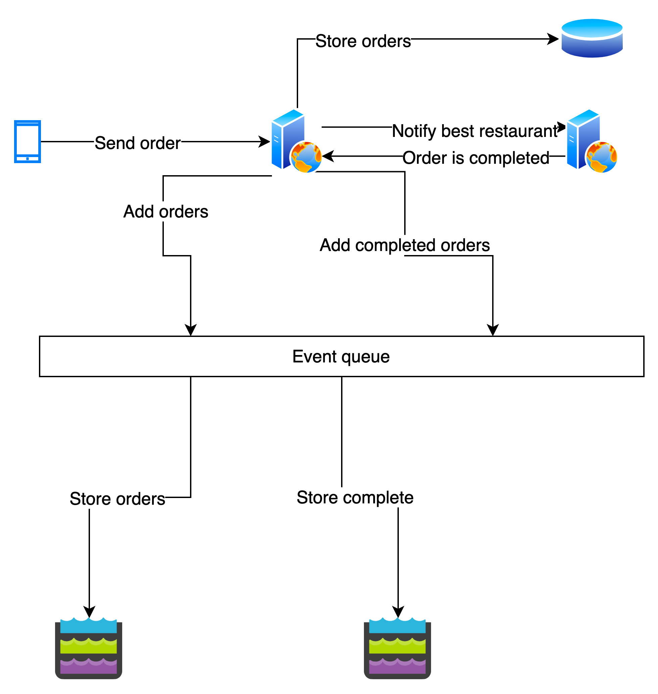

# Not so Dark
The project simulates users running food orders.

A user, from an application, send an order to an HTTP server.

This server insert data in a cache and then produce to Kafka.

An application consumes Kafka in order to store data into datalake. 


## Run project

### Prerequisite
- Install make
- Install docker (with docker-compose)
- Install sbt
### Run Kafka

#### Start docker containers
````bash
make up-kafka
````
#### Create topics
````bash
make topics
````

### Run HTTP server
````bash
make server
````

### Run streaming application
````bash
sbt streaming
````

### Create restaurants
````bash
make restaurants
````
### Send orders
```bash
make create-orders
make complete-orders
```